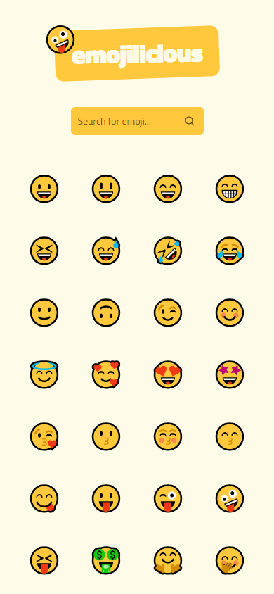

# emojilicious

[**emojilicious**](https://beniusis.github.io/emojilicious) is a simple emoji 🤪 search 🔍 application. Need to find an emoji based on the _special word_? Type it in and see whether there are any suitable emojis to use!

## Table of Contents

- [Overview](#overview)
  - [Features](#features)
  - [Technologies and Tools](#technologies-and-tools)
  - [Screenshots](#screenshots)
- [Setup the Development Environment](#setup-the-development-environment)
  - [Install the required dependencies](#install-the-required-dependencies)
  - [Compile and Hot-Reload for Development](#compile-and-hot-reload-for-development)

## Overview

### Features

- **Search**: users are able to search for emojis by name.
- **Copy**: users are able to copy emojis to clipboard by pressing on them.
- **Dark Mode**: users are able to switch between light/dark theme modes.
- **Responsive Design**: ensuring a seamless user experience across all devices.

### Technologies and Tools

- 📚 **Library**: [React](https://react.dev)
- 😎 **Styling**: [Tailwind CSS](https://tailwindcss.com)
- 🤪 **Data**: [Emoji API](https://emoji-api.com), [node-emoji](https://www.npmjs.com/package/node-emoji)
- ✨ **Code Quality**: [ESLint](https://eslint.org), [Prettier](https://prettier.io)
- 🏗️ **Build Tool**: [Vite](https://vitejs.dev)

### Screenshots




## Setup the Development Environment

### Install the required dependencies

```sh
npm install
```

### Compile and Hot-Reload for Development

```sh
npm run dev
```
